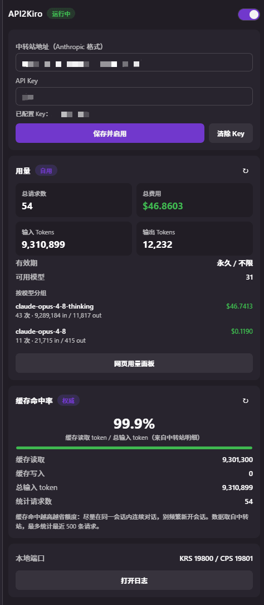

# API2Kiro Multi-Provider Build

English | [简体中文](./README.zh-CN.md)

This local VSIX routes [Kiro](https://kiro.dev) through Kiro-compatible, Anthropic Messages, or OpenAI Responses relays while preserving Kiro's AWS event-stream interface.

> Security notice: API keys published in chats, issues, logs, or screenshots must be revoked and rotated before this extension is used. Enter only a newly rotated key through the local sidebar.

<p align="center">
  
</p>

## Provider modes

| Mode | Upstream endpoint | Authentication |
| --- | --- | --- |
| `kiro` | `/v1/messages` | Kiro-compatible Anthropic headers |
| `anthropic` | `/v1/messages` | Anthropic headers plus Bearer compatibility |
| `openai-responses` | `/v1/responses` | Bearer only |

Each mode has an isolated profile: API key, base URL, default model, model mapping, and model-discovery cache never cross provider boundaries. API keys are stored in VS Code/Kiro `SecretStorage`, not in extension settings. Legacy plaintext values are cleared only after a successful SecretStorage write and exact readback.

## Behavior

- KRS listens on `127.0.0.1:19800`, translates CodeWhisperer requests into the selected provider format, and converts upstream SSE back into Kiro's AWS event-stream frames.
- CPS listens on `127.0.0.1:19801` and serves model/control-plane requests.
- `/v1/models` discovery accepts `{data:[...]}`, `{models:[...]}`, and raw arrays. If discovery fails, only the current profile's manually configured default/mapped models are shown.
- OpenAI Responses uses native function tools, `function_call`, `function_call_output`, reasoning summaries, images, and stateless encrypted reasoning.
- Encrypted OpenAI reasoning is stored in a versioned Kiro reasoning-signature envelope for the next tool turn. Foreign, malformed, or missing envelopes are dropped; the tool result and normal conversation continue without encrypted reasoning replay.
- Retry is allowed only before text, reasoning, or a tool event is committed. A stream failure after visible output is reported once and is never replayed.

### Claude thinking effort

Claude Messages mode displays Kiro's `Low` / `Medium` / `High` / `XHigh` / `Max` selector whenever `api2kiro.effortMode` is not `off`. The selected tier is translated to native Anthropic extended thinking through `thinking.budget_tokens`. A relay that rejects extended thinking must use `api2kiro.effortMode: "off"`; API2Kiro does not silently retry without the selected tier.

## Setup

1. Install `api2kiro-1.8.0.vsix` with `Extensions: Install from VSIX`, then reload Kiro.
2. Open the API2Kiro sidebar and select a provider mode.
3. Enter that mode's relay base URL, a newly rotated API key, and an optional default model/model mapping.
4. Reload Kiro after changing the mode or endpoint configuration.

Model discovery runs automatically. Configure a default model or mapping in the current profile when the relay does not expose `/v1/models`.

## Configuration

| Setting | Description |
| --- | --- |
| `api2kiro.mode` | `kiro`, `anthropic`, or `openai-responses` |
| `api2kiro.baseUrl` / `officialBaseUrl` / `openaiBaseUrl` | Isolated provider base URLs |
| `api2kiro.defaultModel` / `officialDefaultModel` / `openaiDefaultModel` | Per-provider manual fallback model |
| `api2kiro.modelMapping` / `officialModelMapping` / `openaiModelMapping` | Per-provider Kiro-to-upstream model mapping |
| `api2kiro.maxTokens` | Maximum output tokens |
| `api2kiro.effortMode` / `api2kiro.effortBudgets` | Kiro thinking-tier selector and its budgets; in Claude Messages mode the selected tier becomes native Anthropic `thinking.budget_tokens` |
| `api2kiro.autoRetry` / `api2kiro.maxRetries` | Safe pre-commit retry policy |
| `api2kiro.port` / `api2kiro.cpsPort` | Shared local proxy ports |

The API key is intentionally absent from public configuration and is managed through the sidebar/SecretStorage.

## Build and verify

Requires Node.js 18+ and PowerShell 7.

```powershell
npm install
npm test
npm run compile
npm run bundle
npm run package
npm run scan:secrets
```

`npm run package` produces `api2kiro-1.8.0.vsix`. Install it locally with `Extensions: Install from VSIX`. To roll back, reinstall a known-good earlier VSIX with the same command and reload Kiro. The retained `api2kiro.api2kiro` identity supports this local in-place upgrade/rollback flow; this derivative is not an upstream Marketplace release.

## Attribution

This repository is a derivative build of [SunNorthGod/API2Kiro](https://github.com/SunNorthGod/API2Kiro), maintained in [silver-builds-autumn/Kiro-Model-Bridge](https://github.com/silver-builds-autumn/Kiro-Model-Bridge). See [NOTICE](./NOTICE) for the exact derivative status. The original API2Kiro MIT license and publisher/name values are retained for license compliance and local VSIX upgrade compatibility.

The project also acknowledges [kiro2cc-proxy](https://github.com/TsinHzl/kiro2cc-proxy) and the broader Kiro interoperability community for the endpoint-redirection and event-stream translation work that preceded it.

## License

[MIT](./LICENSE)
